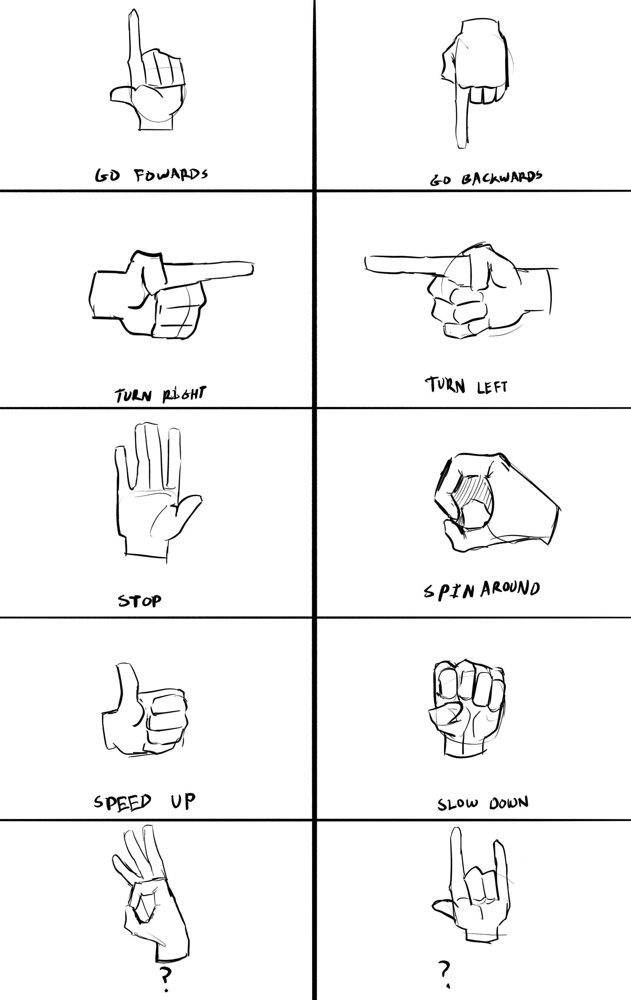

# AI Hand Gesture Controlled Robot

A real-time hand gesture recognition system that controls an ESP32-based robot using computer vision and machine learning. The system uses MediaPipe for hand tracking and TensorFlow for gesture classification.

## 🎯 Features

- **Real-time Hand Gesture Recognition**: Detects and classifies 10 different hand gestures
- **Wireless Control**: Controls ESP32 robot via WiFi connection
- **Visual Feedback**: OLED display on robot shows current command
- **Custom Gesture Training**: Includes Jupyter notebooks for training custom gestures

## 🔧 Hardware Requirements

### Computer Vision System
- Webcam or camera
- Computer with Python 3.7+

### Robot Hardware (ESP32)
- ESP32 Development Board
- 2x DC Motors
- Motor Driver (L298N or similar)
- SSD1306 OLED Display (128x64)
- Power supply for motors
- Robot chassis

### Connections
- Motor 1 → GPIO 32
- Motor 2 → GPIO 33
- OLED Display → I2C (SDA/SCL)

## 💻 Software Requirements

- Arduino IDE or PlatformIO
- ESP32 Board Support
- Required Libraries:
  - Adafruit_GFX
  - Adafruit_SSD1306
  - WiFi
- Python 3.7+

## 📥 Installation

### 1. Clone the Repository
```bash
git clone https://github.com/yourusername/AI-Project-Code.git
cd AI-Project-Code
```

### 2. Install Python Dependencies
```bash
cd gesture-detection-model
pip install -r requirements.txt
```

### 3. ESP32 Setup
1. Open `esp32.ino` in Arduino IDE
2. Install required ESP32 libraries
4. Upload to ESP32 board

## 🚀 Usage

### 1. Start the ESP32 Robot
- Power on the ESP32
- Robot creates WiFi access point: `ESP-32-AI`
- Default IP: `192.168.4.1`
- Server runs on port `12345`

### 2. Run Gesture Recognition
```bash
cd gesture-detection-model
python main.py
```

### 3. Control Modes

Press keys during operation:
- **ESC**: Exit application
- **n**: Normal mode (default)
- **k**: Keypoint logging mode (for training)
- **h**: Point history logging mode (for training)
- **0-9**: Label number for logging training data

## 🤚 Pre-trained Gestures

The system comes with 10 pre-trained hand gestures:



| Gesture ID | Gesture Name | Robot Action | Description |
|------------|--------------|--------------|-------------|
| 0-1 | Nothing | No action | Idle state - no command sent |
| 2 | Pointing | Tracking | Index finger pointing - enables tracking mode |
| 3 | SpinAround | Rotate | Robot spins in place |
| 4 | Stop | Stop Motors | Stops all motor movement immediately |
| 5 | SpeedUp | Increase Speed | Increases motor speed by 10 (max 255) |
| 6 | SlowDown | Decrease Speed | Decreases motor speed by 10 (min 0) |
| 7 | Forward | Move Forward | Robot moves forward |
| 8 | Right | Turn Right | Robot turns to the right |
| 9 | Left | Turn Left | Robot turns to the left |

### Visual Display
The robot's OLED screen shows corresponding icons for each command.

## 🎓 Training Custom Gestures

The project includes two Jupyter notebooks for training custom gesture models:

### 1. Keypoint Classification
```bash
jupyter notebook keypoint_classification.ipynb
```
- Trains hand pose/gesture classifier
- Uses hand landmark coordinates
- Outputs: `keypoint_classifier.tflite`

### 2. Point History Classification  
```bash
jupyter notebook point_history_classification.ipynb
```
- Trains finger movement gesture classifier
- Uses fingertip trajectory data
- Outputs: `point_history_classifier.tflite`

### Adding New Gestures
1. Run `main.py` and press `k` for keypoint mode or `h` for history mode
2. Press `0-9` to select gesture label
3. Perform gesture multiple times
4. Data saved to CSV files in `model/` directory
5. Run corresponding Jupyter notebook to retrain model
6. Update `keypoint_classifier_label.csv` with new gesture names

